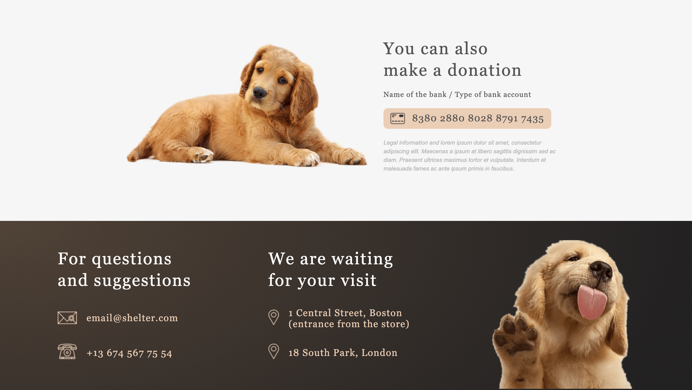
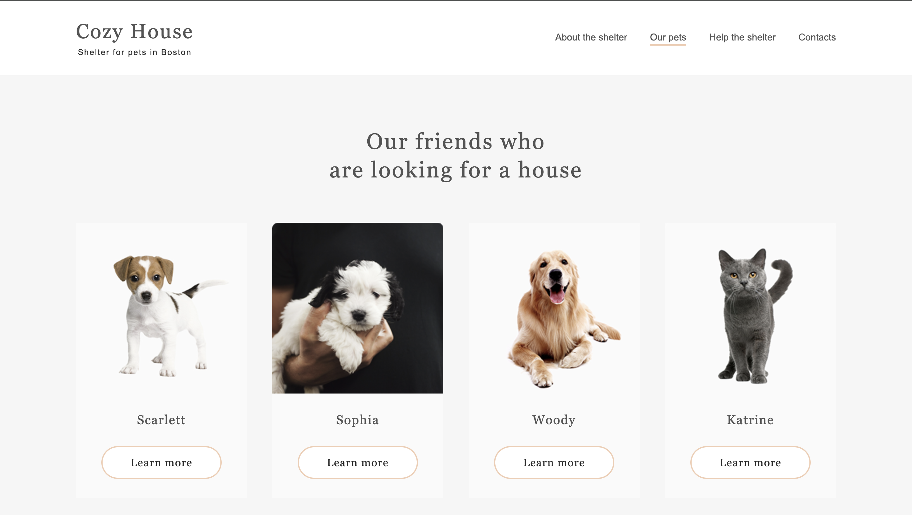

# shelter

HTML + CSS(Sass) + JS

## 📝 Description

Introduction:
- "Pet Shelter " is an interactive website designed for animal lovers, providing the ability to explore and support their favorite furry friends. The website consists of two main pages, offering easy access to a wide range of adorable pets available for adoption and the opportunity to contribute to the shelter's needs.

### 🎮 Functionality:
First Page:

- Users can explore detailed information about the shelter, including its mission, history, and current initiatives.
- A dedicated section highlights various ways users can help the animals in the shelter, such as volunteering, fostering, or donating essential supplies.
- Donation options are prominently displayed, allowing users to contribute funds directly to support the shelter's operations and care for its residents.
- Contact information, including the shelter's address, phone number, and email, is readily accessible for users who wish to reach out for inquiries or assistance.
  
Second Page:
- Users can view profiles of all available pets in the shelter, showcasing their photos, descriptions, and personalities.Clicking on the animal card provides users with detailed information about the specific pet, including its age, breed, temperament, and any special needs it may have, helping potential adopters make informed decisions.

## 🛠️ Technology Stack

- HTML
- CSS (with SASS)
- JS

## 📜 Available Scripts

In the project directory, you can run:

### `npm start` ▶️

Runs the app in the development mode.\
Open [http://localhost:3000/](http://localhost:3000/) to view it in the browser.

### `testing deployment` ▶️

Open [https://precious-mochi-becaaa.netlify.app/](https://illustrious-lily-e1e57a.netlify.app/) to view it in the browser.

## 🚀 Getting Started

To set up and run the project locally, follow these steps:

1. Clone the repository: `git@github.com:papryca/pokemon-api.git`
2. Navigate to the project directory: `cd pokemon-searcher`
3. Install dependencies: `npm install`
4. Start the development server: `npm start`

The application will open in your default browser, allowing you to explore and interact with it.

### `Screenshot`

